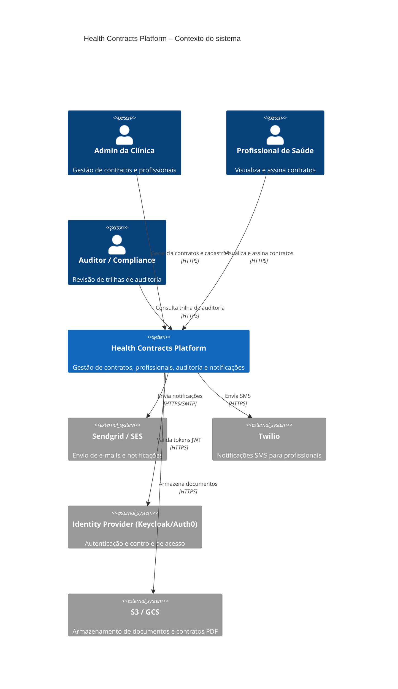
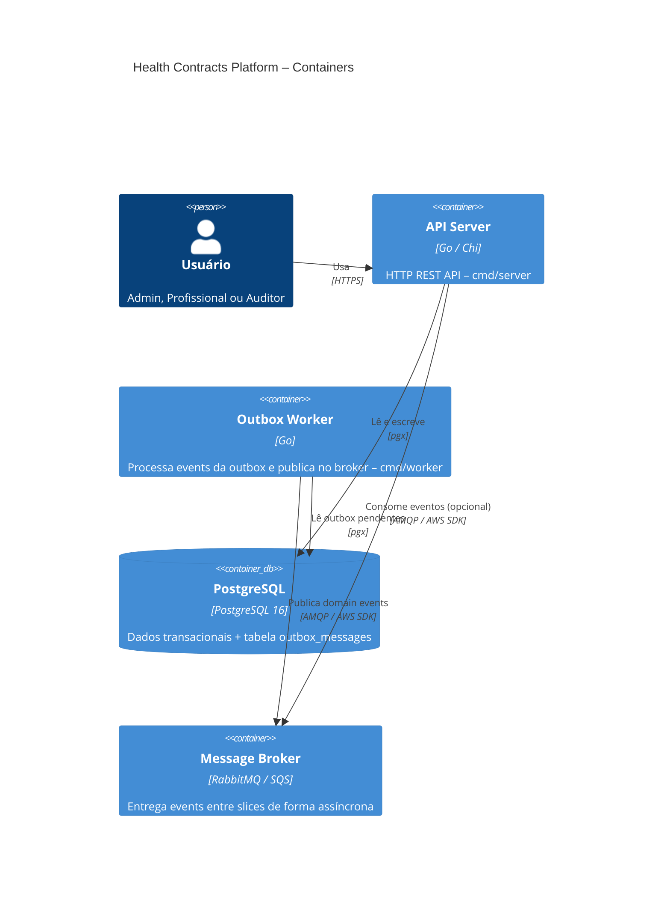

# C4 – Diagrama de contexto

---

## C4 – Diagrama de container

---

## Legenda de cores por slice (nos diagramas de componente)

| Cor | Slice |
|---|---|
| Azul | `contracts/` |
| Verde | `professionals/` |
| Laranja | `audit/` |
| Roxo | `notifications/` |
| Cinza | `shared/` e `infra/` |
